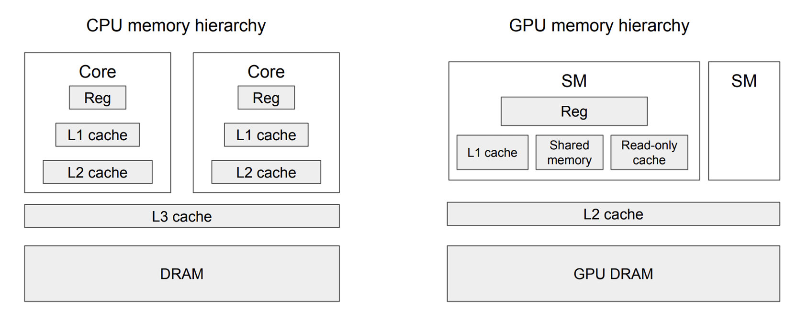

# Microsoft AI Sys Course

课程链接： https://github.com/microsoft/AI-System/tree/main 

## 介绍

本课程的中文名称设定为 人工智能系统，主要讲解支持人工智能的计算机系统设计，对应的英文课程名称为 System for AI。本课程中将交替使用以下词汇：人工智能系统，AI-System 和 System for AI。

本课程为微软人工智能教育与共建社区中规划的人工智能相关教程之一，在A-基础教程模块下，课程编号和名称为 A6-人工智能系统。

欢迎访问微软人工智能教育与共建社区的A-基础教程模块访问更多相关内容。

---

# Notes

## Chap 1 11/30

11/30

DL SYS 分层

1. 开发体验层
    1. 模型构建
    2. 算法实现
    3. 流水线、工作流
    4. 实验规划、配置
    5. 工具链
    6. 生命周期管理
2. 框架层
    1. 计算图构建
    2. 自动求导
    3. 中间表达
    4. 编译优化
        1. 算子融合
3. 运行时
    1. 优化器
        1. JIT 
        2. Introspective
    2. 调度器
        1. 算子并行与调度
    3. 执行器
        1. 多线程
4. 资源管理与硬件体系
    1. 硬件接口抽象
    2. 资源池化
    3. 网络：RDMA InifiBand NVLink
    

## Chap 2&3 11/30

神经网络基础

深度学习框架基础

各种框架的特点

## Chap 4 矩阵运算与计算机体系结构 12/1

规约到矩阵乘法

- 全连接
- 卷积： img2col
- Attention
    - $softmax(Q^T * K)*V$

## CPU体系结构

1 Cycle: 0.3ns (3GHz)

Intel Core i9-11900K：

- L1缓存：40KB指令缓存，48KB数据缓存
- L2缓存：512KB（每个核心）
- L3缓存：16MB（共享）

|  | Cycle | Quantity | Made |  |
| --- | --- | --- | --- | --- |
| Register | 1 | 512 Bytes |  |  |
| L1 | 3 | 32KB | SRAM |  |
| L2 | 10 | 512KB per core | SRAM |  |
| L3 | 50 | 16MB shared | SRAM |  |
| Main Memory | 100 | 32GB maybe 12 cores | DRAM |  |

## GPU 体系结构

- SIMT抽象
    - Grid
        - Block * 32
            - Warp * 32：基础调度单位
                - Thread * 32：执行一个指令，数据不同
- 硬件体系
    
    
    
    - Memory
        
        
        
    - SM

- 乘法优化
    - Thread Block Tile
        
        
        
    - Warp Tile
        
        
        
        
        
    - Thread Tile
        
        
        
        - 每个 Thread 存 8 个A B，然后交叉乘，刚好有 64 个输出，相当于一个 Warp 的操作

## Chap 5 **深度学习的编译与优化 (Deep Learning Compliation and Optimization) 12/2**

计算图优化、内存优化、内核优化和调度优化 

ONNX：通用模型表达格式

算子表达式（Tensor Expression）：往下一层的通用表示？

## 计算图优化

1. 比如 0*x = 0
2. 减少重复计算，缓存计算节点的键值→结果，如果一样直接返回结果
3. 常数折叠，在模型推理中很有用，但可能会导致内存增加，比如 broadcast
4. 矩阵融合，比如有两个向量乘同一个矩阵，可以合成一个大矩阵
5. 算子融合：大量小算子都可以做，可以
    1. 减少中间结果的内存访问
    2. 多个操作共享相同的缓存，这减少了缓存丢失
    3. 每次调用GPU内核都有一定的开销。通过融合多个操作到一个内核调用中，可以显著减少这种开销
    4. 算术强度（Arithmetic Intensity）是计算与内存访问比率的指标。算子融合通常会增加每次内存访问的计算量
    
    GPU算子的调用（特别是内核启动）会有一定的开销。这包括从CPU到GPU的指令传递，线程调度，以及必要的内存操作等
    
6. 子图替换和随机子图替换：编译器在计算图中识别出一个子图并替换成一个等价的新的算子或子图

## 内存优化

输入数据、中间计算结果和模型参数

推理：不需要保存前一层的数据

训练：需要保存前一层的数据

1. **基于拓扑序的最小内存分配**
    
    初始化：拓扑排序算子，建立虚拟内存池，按照顺序分配内存与释放，记录内存偏移，最后得到一个 max 的内存量，实际运行时不需要管理内存，直接按照记录的偏移量分配即可。
    
2. **张量换入换出**
    
    可以将不够放的内存先放在 CPU 里，给定搬运时间系数和算子运行时间，实际上可以抽象为一个优化问题。
    
    给定任意的计算图最小化其执行时间，约束为主存的占用空间，优化变量就是决定放在哪个存储中，在有限的节点规模下，这个问题可以通过整数线性规划模型求解。
    

## 内核优化

**算子编译**的核心思想是首先为通用算子找到一种能够描述算子**与硬件无关**的计算逻辑的表示，然后由编译器根据这种逻辑描述再结合具体的硬件生成相应的内核代码。近年来，有较多的研究工作都在围绕这个问题出现，例如**TVM**, Halide, TACO, Tensor Comprehension, FlexTensor等

利用机器学习搜索，不太懂

## 算子调度优化

问题：

- 单个Op的调度时间与计算时间相比不可忽略，造成较大的调度开销；
- OP的并行度不足以占满GPU的计算核心。
1. 算子融合：更激进
    
    可能需要再中间进行 GlobalSync()
    
2. **编译时全局算子调度**
    
    Rammer: 增加一层抽象（rTask and vEU) vEU → EU
    

## Chap 6 **分布式训练算法与系统 (Algorithms and Systems for Distributed Parallel Training) 12/3**

## 算法

**算子内并行**

主要利用线性计算和卷积等操作内部的并行性

**算子间并行**

> 数据并行：多个样本并行执行
> 
1. 基于参数服务器（Parameter-Server）：缺陷在于每个设备需要保留一份完整的模型副本
    
    实现方便
    
    
    
2. 基于All-Reduce
    
    NVIDIA的NCCL通信库
    
    现在是主流
    

> 模型并行：多个算子并行执行
> 
1. Tensor
    
    
    
2. Pipeline
    
    
    
    
    

> 组合并行：多种并行方案组合叠加
> 

FlexFlow、tofu[[6]](https://github.com/microsoft/AI-System/blob/main/Textbook/%E7%AC%AC6%E7%AB%A0-%E5%88%86%E5%B8%83%E5%BC%8F%E8%AE%AD%E7%BB%83%E7%AE%97%E6%B3%95%E4%B8%8E%E7%B3%BB%E7%BB%9F/6.2-%E5%88%86%E5%B8%83%E5%BC%8F%E8%AE%AD%E7%BB%83%E7%AE%97%E6%B3%95%E5%88%86%E7%B1%BB.md#tofu)、GSPMD 数据和张量并行

PipeDream 同时采用了数据并行和流水并行

**Megatron-LM**[[4]](https://github.com/microsoft/AI-System/blob/main/Textbook/%E7%AC%AC6%E7%AB%A0-%E5%88%86%E5%B8%83%E5%BC%8F%E8%AE%AD%E7%BB%83%E7%AE%97%E6%B3%95%E4%B8%8E%E7%B3%BB%E7%BB%9F/6.2-%E5%88%86%E5%B8%83%E5%BC%8F%E8%AE%AD%E7%BB%83%E7%AE%97%E6%B3%95%E5%88%86%E7%B1%BB.md#Megatron)针对于包含BERT[[8]](https://github.com/microsoft/AI-System/blob/main/Textbook/%E7%AC%AC6%E7%AB%A0-%E5%88%86%E5%B8%83%E5%BC%8F%E8%AE%AD%E7%BB%83%E7%AE%97%E6%B3%95%E4%B8%8E%E7%B3%BB%E7%BB%9F/6.2-%E5%88%86%E5%B8%83%E5%BC%8F%E8%AE%AD%E7%BB%83%E7%AE%97%E6%B3%95%E5%88%86%E7%B1%BB.md#BERT), GPT的Transformer模型家族同时启用了数据并行、模型并行和流水并行，综合发挥各个方式的优势。

## 系统

通信方式

机器内通信：共享内存、GPUDirect P2P over PCIe、GPUDirect P2P over NVLink [[8]](https://github.com/microsoft/AI-System/blob/main/Textbook/%E7%AC%AC6%E7%AB%A0-%E5%88%86%E5%B8%83%E5%BC%8F%E8%AE%AD%E7%BB%83%E7%AE%97%E6%B3%95%E4%B8%8E%E7%B3%BB%E7%BB%9F/6.5-%E5%88%86%E5%B8%83%E5%BC%8F%E8%AE%AD%E7%BB%83%E7%9A%84%E9%80%9A%E4%BF%A1%E5%8D%8F%E8%B0%83.md#ref8)

机器间通信：TCP/IP网络、 RDMA网络和GPUDirect RDMA网络。

## Chap 7 **异构计算集群调度与资源管理系统 (Heterogeneous Computing Cluster Scheduling and Resource Management System)**

异构计算集群调度与资源管理系统在人工智能系统中类似传统 ***操作系统(Operating System)*** 作用.

***平台中的主要组件***：

1. **集群调度与资源管理模块**：其统一管理集群资源，调度作业到集群空闲资源，回收运行完作业的资源。一般控制平面（Control Plane）可以选择使用 Kubernetes[[1]](https://github.com/microsoft/AI-System/blob/main/Textbook/%E7%AC%AC7%E7%AB%A0-%E5%BC%82%E6%9E%84%E8%AE%A1%E7%AE%97%E9%9B%86%E7%BE%A4%E8%B0%83%E5%BA%A6%E4%B8%8E%E8%B5%84%E6%BA%90%E7%AE%A1%E7%90%86%E7%B3%BB%E7%BB%9F/7.1-%E5%BC%82%E6%9E%84%E8%AE%A1%E7%AE%97%E9%9B%86%E7%BE%A4%E7%AE%A1%E7%90%86%E7%B3%BB%E7%BB%9F%E7%AE%80%E4%BB%8B.md#k8s)，YARN[[2]](https://github.com/microsoft/AI-System/blob/main/Textbook/%E7%AC%AC7%E7%AB%A0-%E5%BC%82%E6%9E%84%E8%AE%A1%E7%AE%97%E9%9B%86%E7%BE%A4%E8%B0%83%E5%BA%A6%E4%B8%8E%E8%B5%84%E6%BA%90%E7%AE%A1%E7%90%86%E7%B3%BB%E7%BB%9F/7.1-%E5%BC%82%E6%9E%84%E8%AE%A1%E7%AE%97%E9%9B%86%E7%BE%A4%E7%AE%A1%E7%90%86%E7%B3%BB%E7%BB%9F%E7%AE%80%E4%BB%8B.md#yarn)，Mesos[[3]](https://github.com/microsoft/AI-System/blob/main/Textbook/%E7%AC%AC7%E7%AB%A0-%E5%BC%82%E6%9E%84%E8%AE%A1%E7%AE%97%E9%9B%86%E7%BE%A4%E8%B0%83%E5%BA%A6%E4%B8%8E%E8%B5%84%E6%BA%90%E7%AE%A1%E7%90%86%E7%B3%BB%E7%BB%9F/7.1-%E5%BC%82%E6%9E%84%E8%AE%A1%E7%AE%97%E9%9B%86%E7%BE%A4%E7%AE%A1%E7%90%86%E7%B3%BB%E7%BB%9F%E7%AE%80%E4%BB%8B.md#mesos) 等系统。也可以针对深度学习作业和异构硬件特点，定制化调度策略或者使用开源深度学习调度器，例如 HiveD[[4]](https://github.com/microsoft/AI-System/blob/main/Textbook/%E7%AC%AC7%E7%AB%A0-%E5%BC%82%E6%9E%84%E8%AE%A1%E7%AE%97%E9%9B%86%E7%BE%A4%E8%B0%83%E5%BA%A6%E4%B8%8E%E8%B5%84%E6%BA%90%E7%AE%A1%E7%90%86%E7%B3%BB%E7%BB%9F/7.1-%E5%BC%82%E6%9E%84%E8%AE%A1%E7%AE%97%E9%9B%86%E7%BE%A4%E7%AE%A1%E7%90%86%E7%B3%BB%E7%BB%9F%E7%AE%80%E4%BB%8B.md#hived) 等。
2. 镜像中心：存储 Docker 镜像，供用户提交与共享镜像，作业下载加载镜像。一般可以选用 Docker Hub，或者处于安全和合规要求，构建私有的镜像中心，或者云上镜像中心 Azure Containter Registry 等。
3. 存储模块：在平台中扮演数据平面（Data Plane）角色，存储数据，模型与代码。用户上传数据，作业下载数据和上传结果与模型。存储系统一般根据性能，扩展性，稳定性等需求权衡，可以选用：NFS，Lustre，HDFS 等，或者选用云存储 AWS S3，Azure Blob 等。
4. **作业生命周期管理器**：部署作业，监控作业，重试作业，作业错误诊断。类型属于单作业的控制平面，一般不涉及其他作业情况，自动化机器学习系统也可以构建在平台接口之上进行作业编排。生命周期管理一般可以选择使用 K8s Operator，Framework Controller，YARN AppMaster 等。
5. 集群监控与报警：负责集群硬件，服务与作业的状态监控与报警。监控系统一般可以选择使用 **Promethus + Grafana + Alert Manager** 等开源系统搭建，针对特殊需求开发监控指标收集脚本（例如，Promethus node exporter）。
6. 集成开发环境：平台也会对用户提供 Web 门户，REST服务与集成开发环境 IDE（例如，VS Code 和 Jupyter Notebook）。用户使用这些工具进行作业与数据资源提交与，作业管理监控与调试。
7. 测试集群：为了和生产环境隔离，平台开发工程师可以部署小规模的测试集群，在测试平台进行开发测试，之后再上线到生产环境集群。

### **训练作业，镜像与容器**

1. **环境依赖：镜像**
    
    Docker基于UnionFS
    
    - Union 文件系统是一种将多个文件系统合并为单一视图的机制。在 Docker 中，它被用于将多个镜像层叠加在一起，创建一个统一的文件系统，以便在容器中运行应用程序。常见的 Union 文件系统实现包括 OverlayFS、aufs、btrfs 等。
    - **Layer（层）：** Docker 镜像是由多个文件系统层组成的。每个层都包含了文件或文件夹的变更，以及描述这些变更的元数据。
    - **Union 文件系统：** Docker 使用 Union 文件系统的概念，通过将这些层进行堆叠（overlay）来创建最终的容器文件系统。常用的 Union 文件系统有 OverlayFS、aufs、btrfs 等。
2. **运行时资源隔离：容器**
    
    容器解决资源隔离问题时主要通过控制组（Cgroups）机制解决资源隔离，通过命名空间（Namespace）解决命名空间隔离。
    
    NVIDIA Docker: 不支持**时分复用、内存隔离和动态迁移**
    
    需要哪些System Call来实现容器呢？
    
    1. 拉去镜像，然后创建新的文件系统环境(docker pull)
        1. **`chroot`**（Change Root）是一个用于改变当前进程的根目录的系统调用，它可以用于创建一个新的文件系统环境，让进程以这个新的根目录为根，而且进程无法访问这个新根目录之外的文件系统内容。
    2. 创建新的进程环境，即linux namespace(docker start?)
        1. `unshare` 用于起一个新的namespace
        2. 起一个新的进程作为root，来隔离pid
    3. nsenter进入命名空间(docker exec -it)
    4. 资源限制
        1. 创建cgroup: 主要包括cpu, memory, blkio(block io), net_cls
        2. 通过将pid append到/sys/fs/cgroup/cpu/mygroup/tasks来生效，剩下的交给linux
    
    G**PU虚拟化**
    
    - 应用程序编程接口远程处理（API Remoting）技术：
        - 包装 GPU APIs 作为客户前端，通过一个转发层作为后端，协调所有对 GPU 的访问。挑战之一在于要最小化前端和后端的通信代价，同时 API 转发面临着充分支持的挑战功能，由于侵入的复杂性修改客户软件栈。
        - 代表性工作：[GVirtuS](https://github.com/cjg/GVirtuS)，[vCUDA](https://github.com/tkestack/vcuda-controller)，[rCUDA](http://www.rcuda.net/)，[qCUDA](https://github.com/coldfunction/qCUDA)。
    - 直接 GPU 直通（Direct GPU Pass-Through）技术：
        - 在 Direct GPU pass-through 技术中，GPU 被单个虚拟机独占且永久地直接访问，其实现的GPU资源隔离粒度为单块GPU，不支持热迁移。GPU 直通是一种允许 Linux 内核直接将内部 GPU 呈现给虚拟机的技术，该技术实现了 96-100% 的本地性能，但 GPU 提供的加速不能在多个虚拟机之间共享。
        - 代表性工作：例如，NIVIDIA 对公有云厂商 [Amazon AWS, Microsoft Azure, Google Cloud Platform, Alibaba Cloud](https://docs.nvidia.com/grid/cloud-service-support.html) 提供 GPU pass-through 技术等。
    - [中介直通（Mediated Pass-Through）](https://www.usenix.org/system/files/conference/atc14/atc14-paper-tian.pdf)技术：
        - 直通传递性能关键型资源和访问，而在设备上中介代理（Mediating）特权操作，使用性能好，功能齐全，共享能力强。
        - 代表性工作：NIVIDIA 对公有云厂商 [Amazon AWS, Microsoft Azure, Google Cloud Platform, Alibaba Cloud](https://docs.nvidia.com/grid/cloud-service-support.html) 提供的 vGPU 技术.
    
    GPU隔离
    
    - [NVIDIA 多实例 GPU（Multi-Instance GPU）简称 (MIG)](https://www.nvidia.com/en-us/technologies/multi-instance-gpu/)：多实例 GPU 是 NVIDIA 在 Ampere 系列 GPU 中开始支持的，在硬件层面将 GPU 实例进行隔离与虚拟化的技术，支持缓存，内存，物理计算核的隔离，但是有隔离粒度的限制。多实例 GPU (MIG) 可扩展每个 NVIDIA A100 GPU 的共享能力和利用率。MIG 可将 A100 和 H100 GPU 划分为最多达七个实例，每个实例均与各自的高带宽显存、缓存和计算核心完全隔离。
    - [NVIDIA 多进程服务（Multi-Process Service）简称（MPS）](https://docs.nvidia.com/deploy/pdf/CUDA_Multi_Process_Service_Overview.pdf)：多进程服务 (MPS) 是 NVIDIA 提供的软件层共享物理 GPU 资源并提供一定程度进程级虚拟化的技术。MPS 运行时架构旨在透明地支持多进程 CUDA 应用程序，通常是 MPI 作业。其利用 [Hyper-Q](https://developer.download.nvidia.com/compute/DevZone/C/html_x64/6_Advanced/simpleHyperQ/doc/HyperQ.pdf) 功能实现，**Hyper-Q 允许 CUDA 内核在同一 GPU 上并发处理。**
    
    ### 调度
    
    - 指标
        
        作业延迟与吞吐相关指标：
        
        - 排队延迟（Queuing Delay）：描述作业在调度器队列中等待资源分配所花费的时间，排队延迟越低，代表用户作业需要等待的时间越短，越高效。主要受两个因素影响，一个是公平性，由于用户作业用完所分配的配额，另一个是局部性（Locality）和资源碎片问题造成资源无法分配和等待。
        - 平均响应时间（Average Response Time）：平均响应时间是从提交请求到产生第一个响应的时间量的平均。平台希望平均响应时间越短越好。
        - 平均作业完成时间（Job Completion Time）：一批作业的平均完成时间，指标能够代表系统性能。例如，考虑分布式作业的局部性，影响通信时间，进而影响JCT。
        - 完工时间（Makespan）：对一批作业，第一个作业到达到最后一个作业完成的整体时间，希望其越小越好，有些调度算法也考虑所有作业的整体完工时间作为优化目标，因为最小化完工时间（Makespan）等价于最大化资源效率（Efficiency）。
        - 吞吐（Throughput）：单位时间能完成的作业数量。平台希望吞吐量越大越好。
        
        平台资源利用率相关指标：
        
        - 资源利用率（Utilization) ：描述用于作业的资源占总资源的百分比。平台希望利用率越高越好。
        - 资源碎片（Fragmentation）：作业分配后造成个别节点资源无法被再分配，产生碎片问题。碎片越少，代表资源浪费越少。也是和资料利用率相关的指标。
        
        公平与服务水平相关指标：
        
        - 公平性（Fairness）：资源使用在平台用户或组之间平均或按指定配额比例分配。
        - 服务水平协议（SLA）：服务级别协议 (SLA-service-level Agreement) 是平台和用户之间的承诺。例如，平台服务的公平性，质量、可用性、责任等在平台和用户之间进行约定和达成一致。
    
    不同的调度算法，不同的倾向性。
    

# Chap 8 **深度学习推理系统 (Deep Learning Inference Systems)**

特点

- 不需要BP
- 长期稳定运行
- 底层设备多样
- 资源少

目标

1. 低延迟 Latency
2. 高吞吐 QPS - Throughout
3. 可扩展 Scale
4. 准确度 Accuracy

---

1. 灵活性
2. 高效率

# Chap 9 计算图的编译与优化

和之前一样啊

# Chap 10 稀疏化

- 稀疏
- 剪枝
- 蒸馏
- 量化

# Chap 11 自动机器学习 AutoML

没啥东西

12.30

- 结束学习
- 重点是ML框架层面的抽象、优化，侧重于LLM，包括训练和推理。

[GCloud](https://www.notion.so/GCloud-61321db503694e51aed8cb00ccaae550?pvs=21)